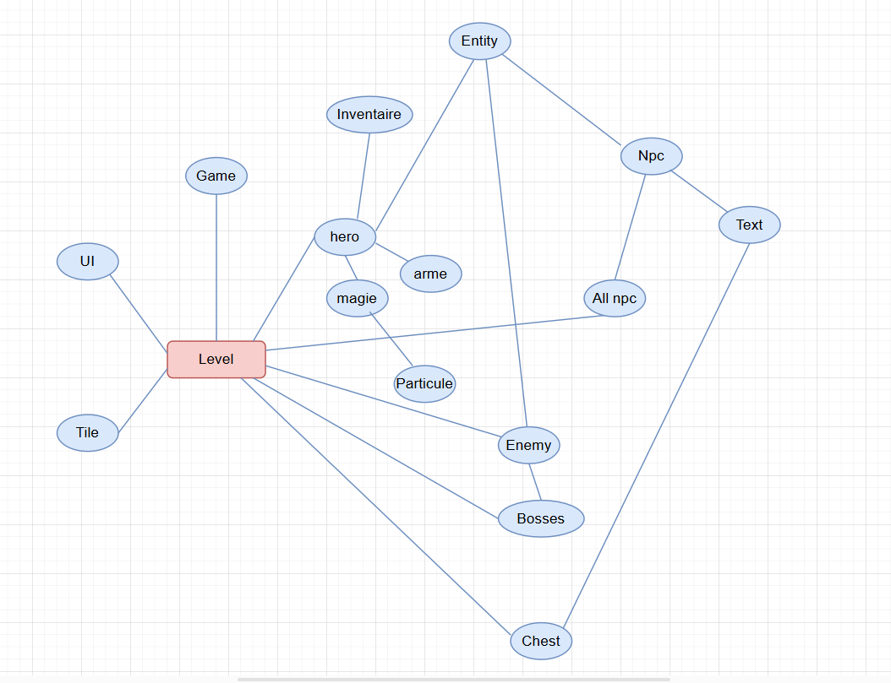

## Organisation des Classes

## Explication des Modules

### `armes.py`

* **Rôle**  
    * Créer les instances Armes

* **Dépendance**  
 

### `Boss.py`

* **Rôle**  
    * Créer les boss dans le jeu

* **Dépendance**  
    * `enemy.py`

### `button.py`

* **Rôle**  
    * Programme les boutons qui pourront être cliqués

* **Dépendance**  
 

### `debug.py`

* **Rôle**  
    * Permet d'afficher les valeurs de certaines variables à l'écran en temps réel

 

### `enemy.py`

* **Rôle**  
    * Permet de coder chaque ennemi du jeu qui pourra infliger des dégâts au joueur

* **Dépendance**  
    * `entity.py`

### `entity.py`

* **Rôle**  
    * Gère les collisions et mouvements de chaque ennemi/NPC/héros

* **Dépendance**  
 

### `Game.py`

* **Rôle**  
    * Créer la boucle principale du jeu

* **Dépendance**  
 

### `hero.py`

* **Rôle**  
    * Permet de créer le personnage principal du jeu

* **Dépendance**  
    * `entity.py`, `inventaire.py`, `magie.py` , `armes.py`

### `import_tool.py`

* **Rôle**  
    * Permet d'importer et stocker des fichiers CSV et des dossiers ainsi que leur contenu

* **Dépendance**  
 

### `inventaire.py`

* **Rôle**  
    * Permet de coder l'inventaire du héros

* **Dépendance**  
 

### `level.py`

* **Rôle**  
    * Met en commun tous les éléments du jeu

* **Dépendance**  
    * `tile.py` , `UI.py` , `Game.py` , `hero.py` , `enemy.py` , `Boss.py`

### `magie.py`

* **Rôle**  
    * Permet de coder l'attaque magique

* **Dépendance**  
    * `particules.py`

### `main.py`

* **Rôle**  
    * Affiche le menu principal et lance le jeu

* **Dépendance**  
    * `Game.py` , `button.py` , `settings.py`

### `NPC.py`

* **Rôle**  
    * Permet de coder les NPC ainsi que leurs dialogues

* **Dépendance**  
    * `entity.py`

### `particules.py`

* **Rôle**  
    * Permet de coder les particules qui seront visibles lors d'une attaque de type 'magie'

* **Dépendance**  
 

### `settings.py`

* **Rôle**  
    * Contient les dimensions de l'écran, les données des monstres et de la magie

* **Dépendance**  
 

### `tile.py`

* **Rôle**  
    * Créer les cases de collision

* **Dépendance**  
 

### `UI.py`

* **Rôle**  
    * Affiche certaines données du héros à l'écran

* **Dépendance**  