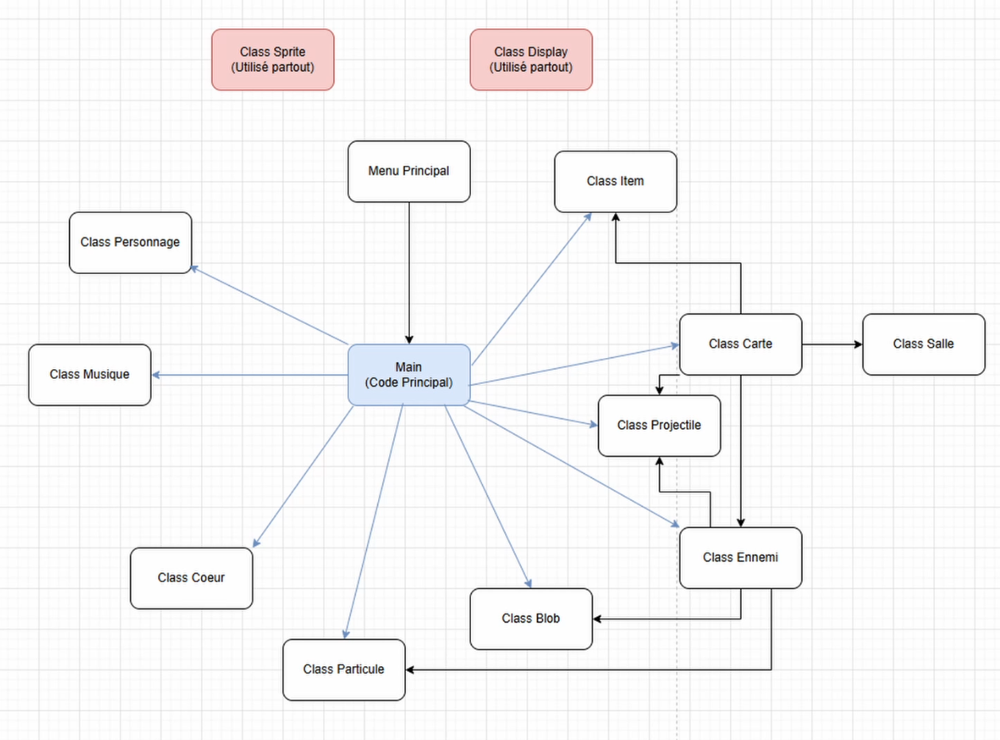

# Structure du code:




## `main.py`
* **Rôle**: Rassembler tous les fichiers ensemble pour faire tourner le jeu
* **Fonctionnalité**: Permet l’ouverture la fermeture du jeu, le rafraîchissement de tous les objets, ainsi que les mouvements du joueur
* **Dépendances**: `ClassDisplay.py` , `ClassSprite.py`, `ClassPersonnage.py`, `ClassCoeur.py`, `ClassCarte.py`, `ClassProjectile.py`, `ClassParticule.py`, `ClassBlob.py`, `ClassMusique.py`, `mainscreen.py`


## `mainscreen.py`
* **Rôle**: Créer le menu principal
* **Fonctionnalité**: Permet l’affichage et de gérer le menu avant que le jeu soit lancé
* **Dépendances**: `ClasseMusique.py`, `ClassSprite.py`, `ClassDisplay.py`


## `ClassBlob.py`
* **Rôle**: Gère l’encre que les ennemis laissent tomber, ramassable par le joueur
* **Fonctionnalité**: Permet la création, la collision et la suppression des Blobs
* **Dépendances**: `ClassDisplay.py`, `ClassSprite.py`, `ClassMusique.py`

## `ClassCarte.py`
* **Rôle**: Créer et gérer la carte
* **Fonctionnalité**: Génération des salles, des ennemis, des trésors et du Boss
* **Dépendances**: `ClassDisplay.py`, `ClassSprite.py`, `ClassEnnemi.py`, `ClassItem.py`

### Classe Salle:  
* **Rôle**: Représente les tuiles qui forment la carte (les salles individuelles)

### Classe CarteDuMondeV2:
* **Rôle**: Représente la carte du jeu (l'ensemble des tuiles)

## `ClassCoeur.py`
* **Rôle**: Créer et gérer les coeurs (UI)
* **Fonctionnalité**: Création, modifications et suppression des coeurs
* **Dépendances**: `ClassSprite.py`

## `ClassDisplay.py`

### Classe Fenetre
* **Rôle**: Créer des fenêtres sur l'écran
* **Fonctionnalité**: Permet l’affichage et et des méthodes pour gérer une nouvelle fenêtre sur l'écran
* **Dépendances**: ClassSprite.py

## `ClassEnnemi.py`
* **Rôle**: Créer et gérer les ennemis
* **Fonctionnalité**: Création des ennemis, comportements des ennemis, mort des ennemis, attaque des ennemis
* **Dépendances**: `ClassSprite.py`, `ClassDisplay.py`, `ClassProjectile.py`, `ClassBlob.py`, `ClassParticule.py`, `ClassMusique.py`
* **Types d’ennemis existants**: 
    * “Stickman”, “Oeil”, “Cube”, “Cube2”, “Cubisme”, “Main”, “Maurice”

## `ClassItem.py`
* **Rôle**: Créer et gérer les items
* **Fonctionnalité**: Modifier les statistiques du joueur, afficher une description des items
* **Dépendances**: `ClassSprite.py`, `ClassDisplay.py`, `ClassMusique.py`, `ClassCoeur.py`
* **Types d'item**:
    * 1: "schéma de coeur" - donne de l'armure (coeur temporaire)
    * 2: "gants pour tablette" - augmente la vitesse d'attaque
    * 3: "boisson énergisante augmente la vitesse de mouvement
    * 4: "cartouche d'encre" - augmente la capacité d'encre
    * 5: "gomme" - augmente l'attaque du joueur
    * 6: "coeur vide" - ajoute un coeur permanent

## `ClassMusique.py`
* **Rôle**: Initialiser et jouer les fichiers son
* **Fonctionnalité**: Permet de jouer les fichiers .mp3 et .wav sur différents canaux
* **Dépendances**: aucune

## `ClassParticule.py`
* **Rôle**: Créer des particules (effets visuels)
* **Fonctionnalité**: permet la création et le fonctionnement de particules
* **Dépendances**: `ClassSprite.py`

## `ClassPersonnage.py`
* **Rôle**: Joueur
* **Fonctionnalité**: Permet l’affichage, les animations et les attaques du joueur, il est aussi possible de changer les stats du joueur
* **Dépendances**: `ClassSprite.py`, `ClassDisplay.py`, `ClassProjectile.py`

## `ClassProjectile.py`
* **Rôle**: Faire les projectiles des ennemis et du joueur
* **Fonctionnalité**: Permet la création, le déplacement, les collisions, le comportement et la suppression des projectiles
* **Dépendances**: `ClassSprite.py`, `ClassMusique.py`

## `ClassSprite.py`
* **Rôle**: Créer des sprites pygame pour afficher les images et créer des objets dans le jeu
* **Fonctionnalité**: Permet la création de tout objet et de tout éléments dans le jeu et permet aussi de gérer tous ces objets aussi avec l’animation ainsi que des collisions
* **Dépendances**: aucune

# Arborescence
```bash
X-Quisse/
├── main.py
├── mainscreen.py
├── ClassEnnemi.py
├── ClassItem.py
├── ClassProjectile.py
├── ClassCoeur.py
├── ClassParticule.py
├── ClassBlob.py
├── ClassCarte.py
├── ClassDisplay.py
├── ClassMusique.py
├── ClassPersonnage.py
├── ClassSprite.py
└──Images/
    └── pixel art du jeu

```
